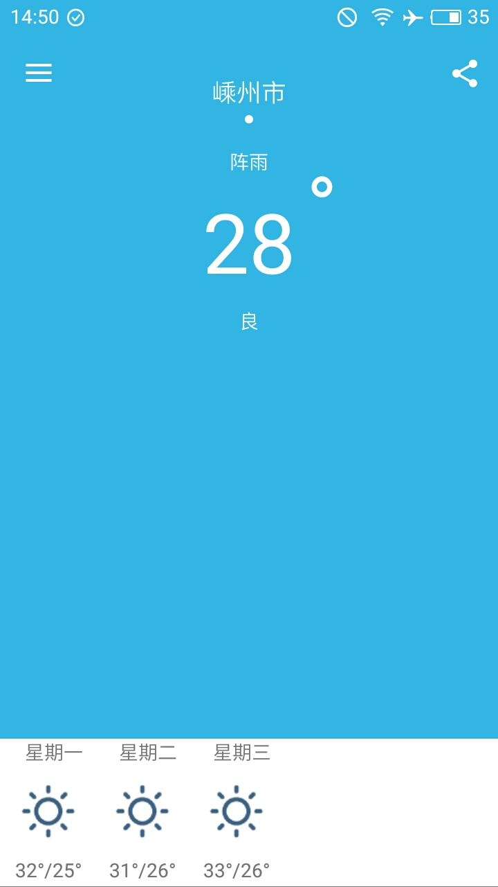
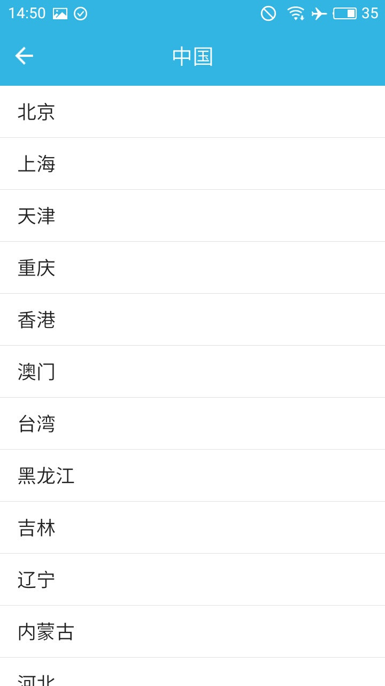
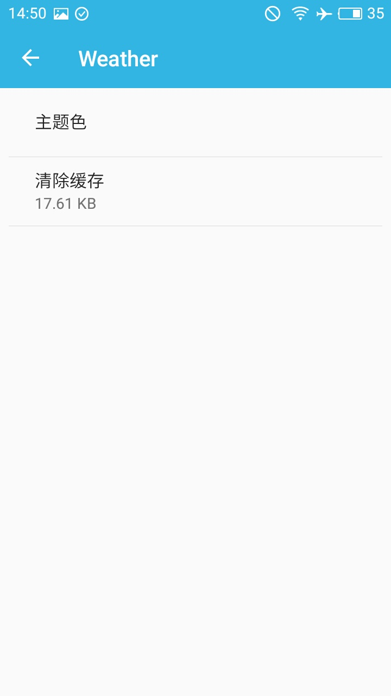
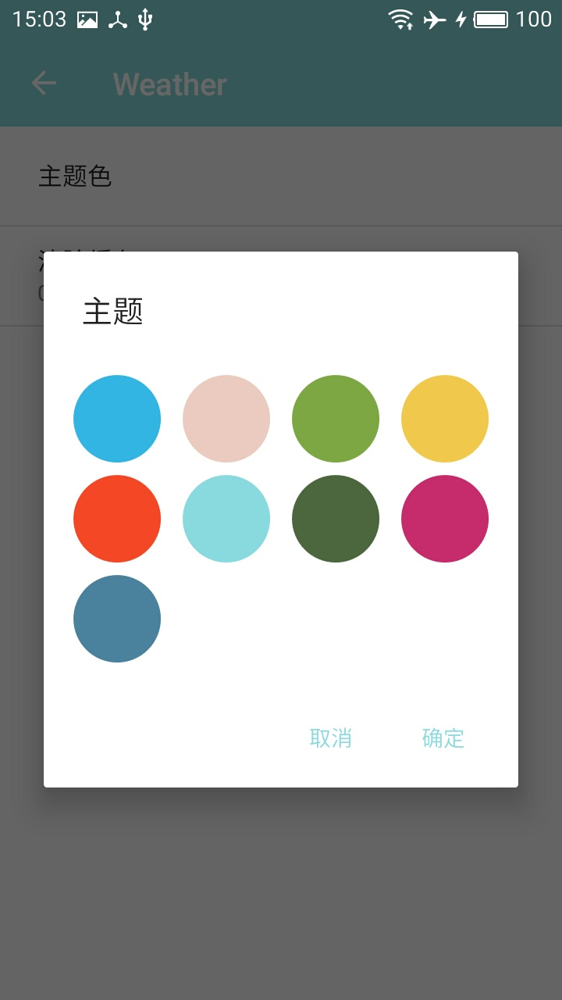
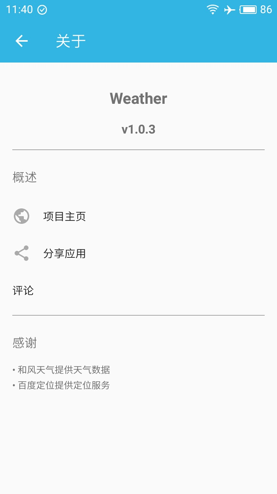

# CoolWeather

整体架构: MVP+Kotlin+Retrofit2+RxJava2
(天气api改成和风天气的原api，添加拖拽和滑动，自动定位，添加城市，分享)

mvp参考: 官方的mvp项目(https://github.com/googlesamples/android-architecture/tree/todo-mvp-kotlin/)
天气UI界面可以参考(PS:　暂时还没写进去，打算学习自定义View的时候再加入项目里): Pure天气（https://github.com/Mixiaoxiao/Weather） 和 （https://github.com/li-yu/FakeWeather）

v1.0.1: 增加刷新功能
v1.0.2: 添加主题切换，清除缓存功能，点击item跳转功能
V1.0.3 : 增加了桌面小部件

## Screenshots

 

## Thanks to the open source project

* [RxJava](https://github.com/ReactiveX/RxJava)
* [Retrofit](https://github.com/square/retrofit)
* [LitePal](https://github.com/LitePalFramework/LitePal)
* [Glide](https://github.com/bumptech/glide)
* [RxPermission](https://github.com/tbruyelle/RxPermissions)
* [BaseRecyclerViewAdapterHelper](https://github.com/CymChad/BaseRecyclerViewAdapterHelper)
* [Bugly](https://bugly.qq.com/docs/user-guide/instruction-manual-android/?v=20180521124306) 
* [Leakcanary](https://github.com/square/leakcanary)

